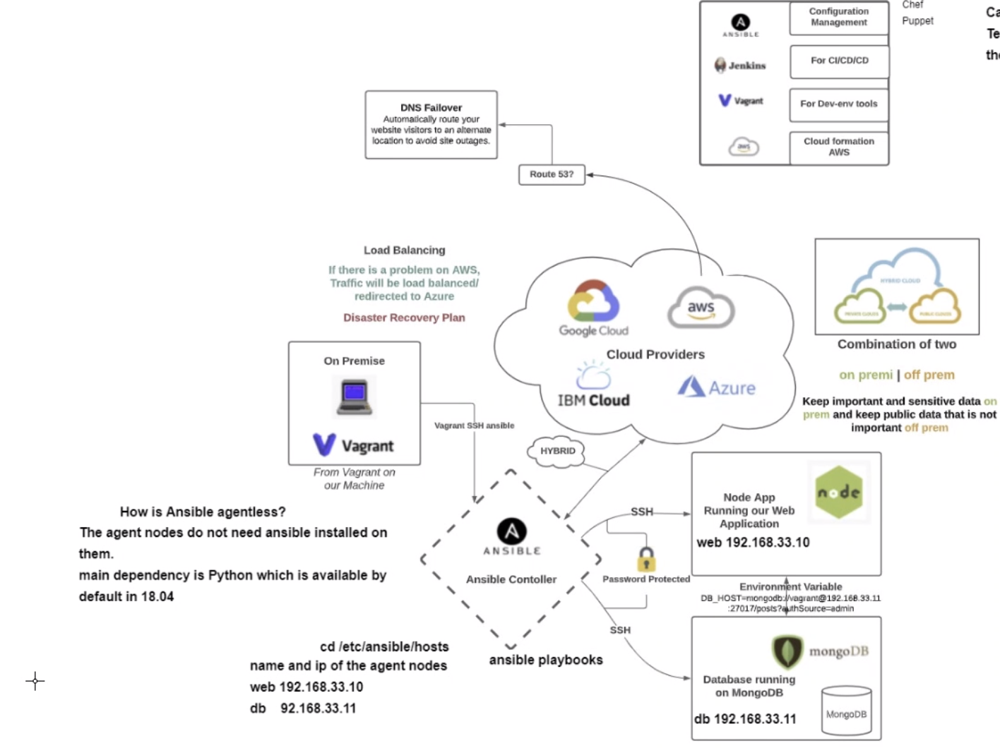

# Ansible controller and agent nodes set up guide


#### Steps
- 1. set up controller with python, pip3 and boto3
- 2. aws keys with ansible vault setup
- 2.1. ensure ansible is using python 3 and above
- if it is using 2.7; create alias/export variable/inject in playbook or hosts file - playbook command: `ansible_python_interpreter: usr/bin/python3`
- 3. generate ssh key inside controller /.ssh folder - eng89_devops.pem, eng89_devops and eng89_devops.pub
- `scp -i eng89_devops.pem -r eng89_devops.pem vagrant@192.168.33.12:~/.ssh/` for .pem, and use key generation command inside the controller .ssh folder `ssh-keygen -t RSA -C "twilliams@spartaglobal.com"`, saving the key pair as eng89_devops
- 4. for first time copying and using file, run `chmod 400 key_name`
- 5. run `ansible-playbook name_of_playbook --ask-vault-pass` and enter vault password when prompoted
- to ping the ec2 we need to add the ec2 IP to the hosts file with pem file authentifacation: `[aws]
ec2-instance ansible_host=54.75.55.227 ansible_user=ubuntu ansible_ssh_private_key_file=~/.ssh/eng89_devops.pem`
- whenn shhing into the ec2, ensure you are in the same location as the .pem key or you specify it in the ssh command

- ansible controller can be used to configure vagrant machines and cloud instances
- ansible vault can be used to help secure access keys
- ansible performs well in cases of 100s of servers
- the file /etc/ansible/hosts in the controller is used for instance details to connect to the agents nodes - name and IP of nodes
- the playbook contains instructions for the controller
- ansible has a python dependency, available by default on ubutu 18.04
- ansible is cloud independent - works on any service

## Infrastructure as code
- two parts: configuration management (chef, puppet and ansible) and orchestration (AWS, ansible and terraform)
- everything is code - we codify tasks and instructions
- no manual handling, all instructions pre written and one command runs it all
- ansible controller is agentless as only controller needs ansible installations - agent nodes don't need it

## We will use 18.04 ubuntu for ansible controller and agent nodes set up 
### Please ensure to refer back to your vagrant documentation

- **You may need to reinstall plugins or dependencies required depending on the OS you are using.**

```vagrant 
# -*- mode: ruby -*-
# vi: set ft=ruby :

# All Vagrant configuration is done below. The "2" in Vagrant.configure
# configures the configuration version (we support older styles for
# backwards compatibility). Please don't change it unless you know what

# MULTI SERVER/VMs environment 
#
Vagrant.configure("2") do |config|

# creating first VM called web  
  config.vm.define "web" do |web|
    
    web.vm.box = "bento/ubuntu-18.04"
   # downloading ubuntu 18.04 image

    web.vm.hostname = 'web'
    # assigning host name to the VM
    
    web.vm.network :private_network, ip: "192.168.33.10"
    #   assigning private IP
    
    config.hostsupdater.aliases = ["development.web"]
    # creating a link called development.web so we can access web page with this link instread of an IP   
        
  end
  
# creating second VM called db
  config.vm.define "db" do |db|
    
    db.vm.box = "bento/ubuntu-18.04"
    
    db.vm.hostname = 'db'
    
    db.vm.network :private_network, ip: "192.168.33.11"
    
    config.hostsupdater.aliases = ["development.db"]     
  end

 # creating are Ansible controller
  config.vm.define "controller" do |controller|
    
    controller.vm.box = "bento/ubuntu-18.04"
    
    controller.vm.hostname = 'controller'
    
    controller.vm.network :private_network, ip: "192.168.33.12"
    
    config.hostsupdater.aliases = ["development.controller"] 
    
  end

end
```
- Ansible is a **push** configuration - all commands pushed from controller
- to run commands from controller in instance: `ansible <instance_name> -m shell -a "commands"`
- ansible vault used to encrypt keys - can be .gitignore, secret.txt
- ansible verifies keys for AWS e.g. then goes onto to do playbook tasks

- security on premise
- security in the cloud
- security in transit


